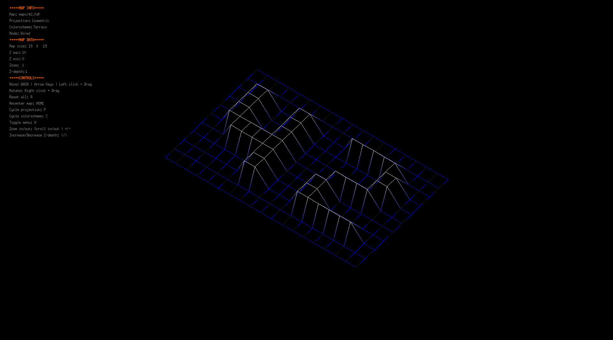
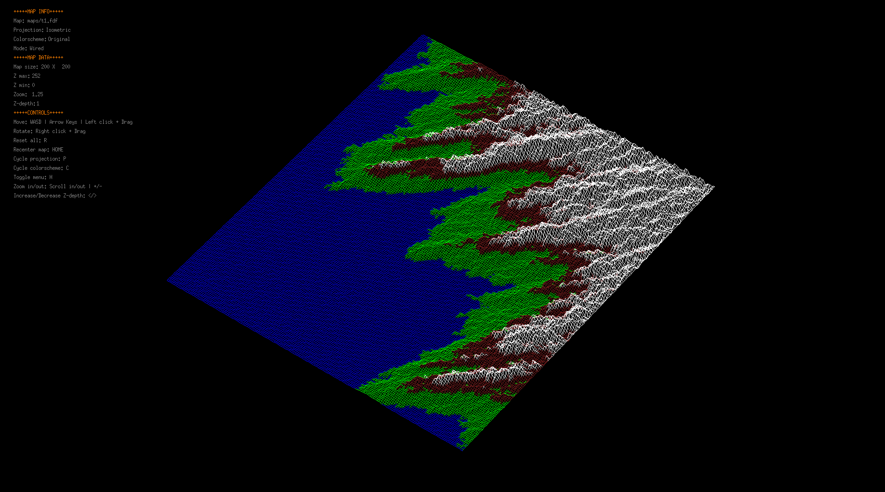
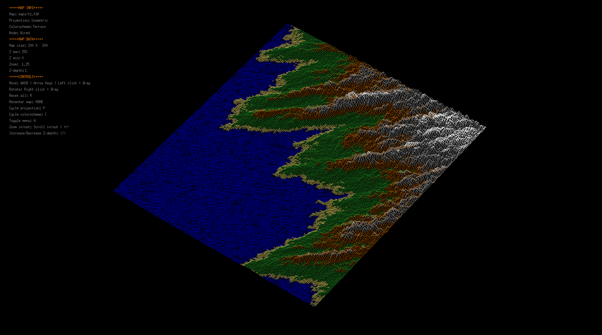

# **FdF**
##### Graded 125/100

### About
This project is one of the 3 available introductory graphical project. It requires the parsing of a map file and it's projection to a 3D space, allowing the rotation, translation, and scaling of the map.  

### Compilation
To compile just run `make` at the project root. You can use `make run` to run the program with a default map, or pass the map path as the program parameter:
```sh
$ ./fdf <path_to_map>
```
You can find some example maps [here](https://github.com/EcoGecko/42_fdf/tree/master/extras).

### Examples

Basic 42 map with custom colorscheme

```sh
$ ./fdf extras/maps/42.fdf
```
Terrain projection using default colors

Same map but using a custom colorscheme

```sh
$ ./fdf extras/maps/t1.fdf
```
